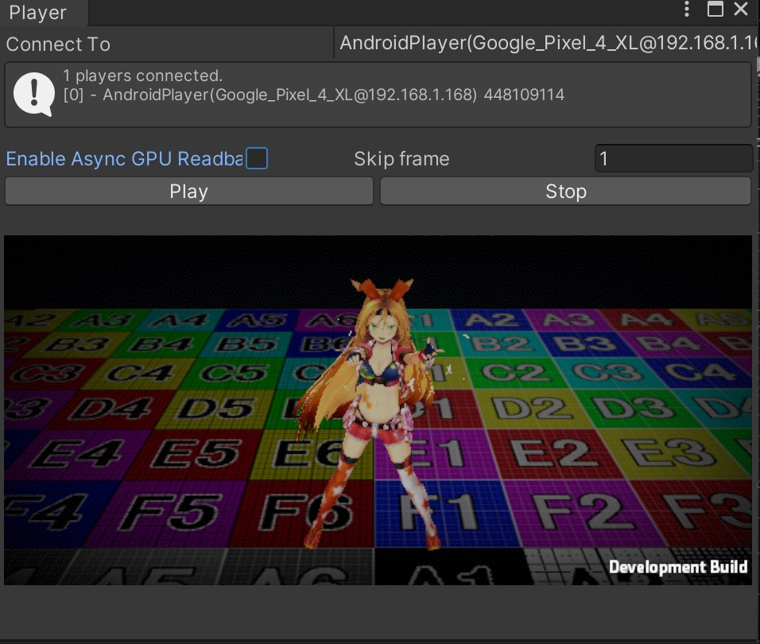
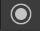
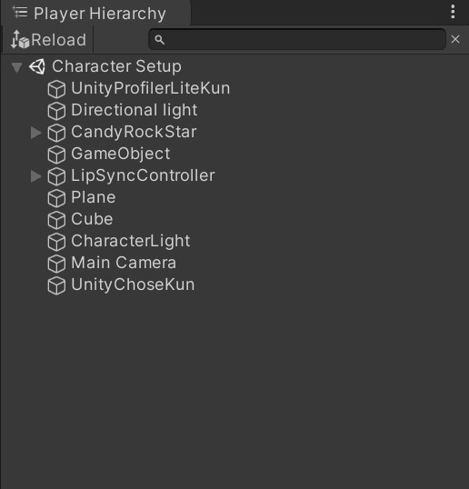
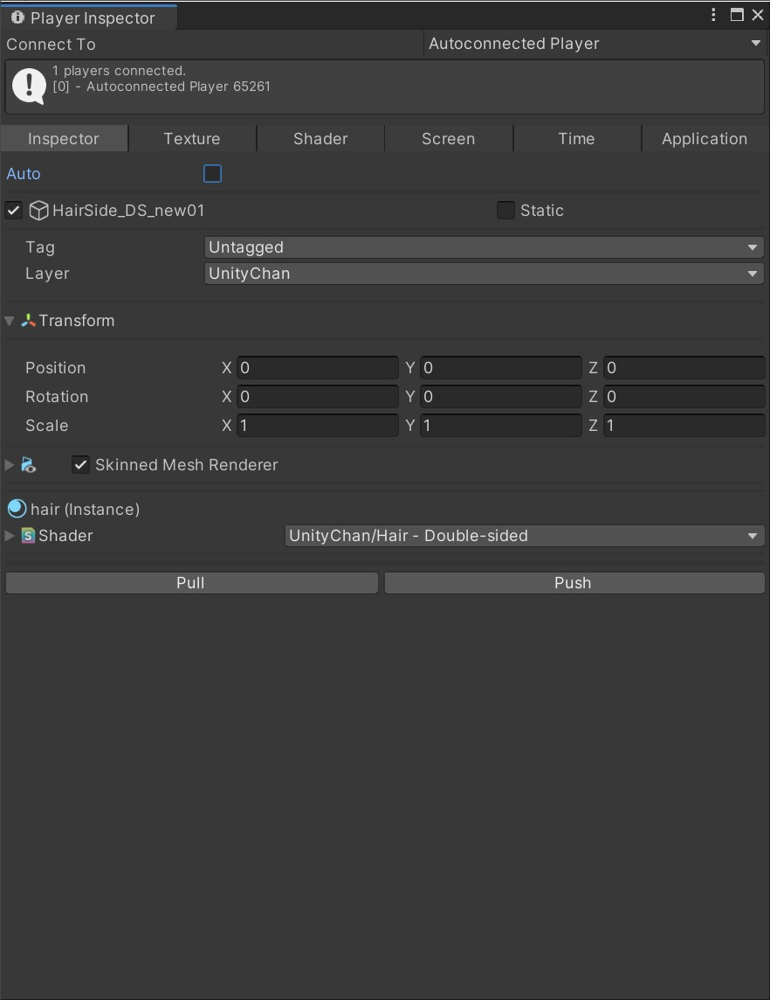
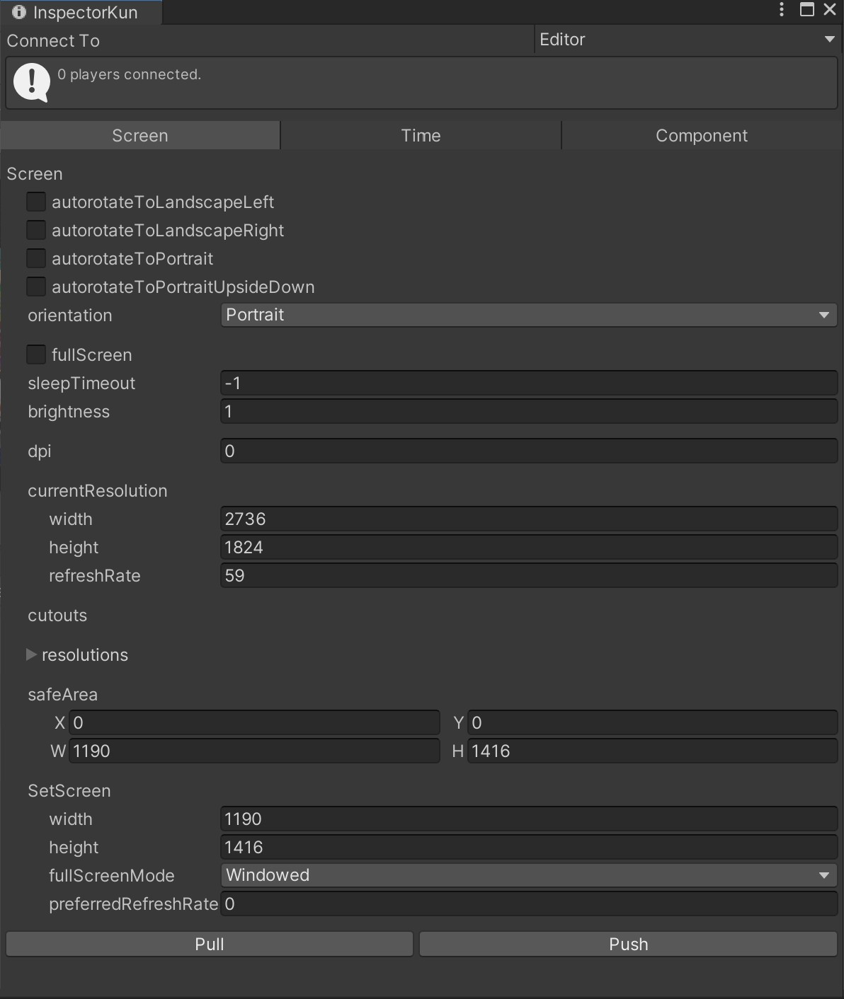
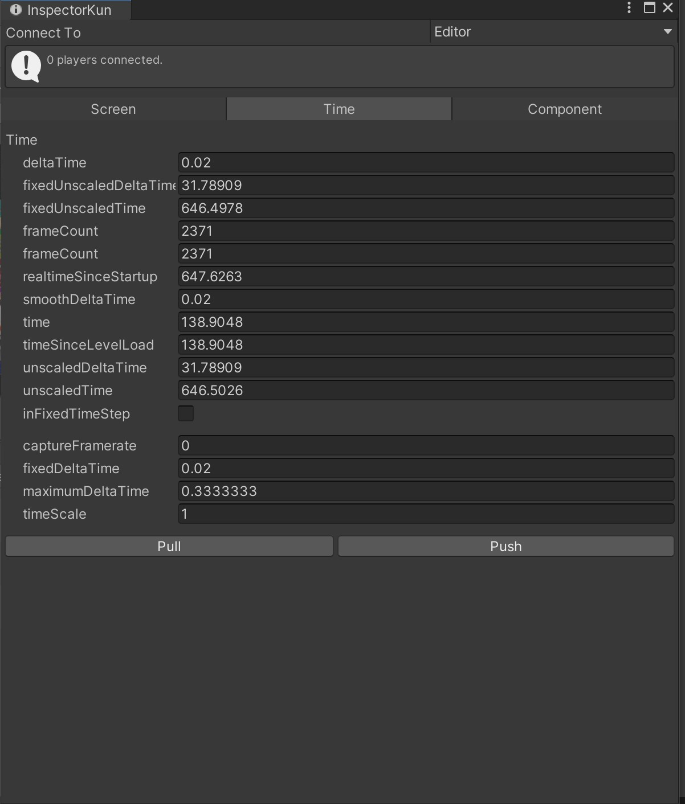

# UnityChoseKun
## Summary

Tool used to control application built with Unity running on a device (Switch,Android,iOS,etc) from UnityEditor.

Ex1.Can adjust the component inside the application that are running

Ex2.Could show UnityEditor from the device's screen

## What you can do with this project
The following tasks can be performed in the UnityEditor
- Display the screen rendered on the device (PlayerView).
- Display hierarchy of the scene being played in the actual device (Hierarchy View)
- Reflect the changes made to the selected GameObject's component to the actual device (Inspector View).

## Operating Environment
- Unity version
  - Unity2018.4.26f1 (Some limited functions)
  - Unity2019.4.11f1
- Platform
  - Android
    - Pixel3XL
    - Pixel4XL
  - iOS
    - iPhone 6S

## Adjustable Components
You can make adjustments on the following components
- [Application](docs.unity3d.com/ja/ScriptReference/Application.html)
- [Screen](https://docs.unity3d.com/ja/ScriptReference/Screen.html)
- [Time](https://docs.unity3d.com/ja/ScriptReference/Time.html)
- [Shader](https://docs.unity3d.com/ja/ScriptReference/Shader.html)
- [Texture](https://docs.unity3d.com/ja/ScriptReference/Texture.html)
- [QualitySettings](https://docs.unity3d.com/ja/ScriptReference/QualitySettings.html)
- [Component](docs.unity3d.com/ja/ScriptReference/Component.html)
  - [Animator](https://docs.unity3d.com/ja/ScriptReference/Animator.html)
  - [Behaviour](https://docs.unity3d.com/ja/current/ScriptReference/Behaviour.html)
  - [Bounds](https://docs.unity3d.com/ja/current/ScriptReference/Bounds.html)
  - [Camera](https://docs.unity3d.com/ja/ScriptReference/Camera.html)
  - [Collider](https://docs.unity3d.com/ja/ScriptReference/Collider.html)
  - [Light](https://docs.unity3d.com/ja/ScriptReference/Light.html)
  - [Material](https://docs.unity3d.com/ja/ScriptReference/Material.html)
  - [Matrix4x4](https://docs.unity3d.com/ja/current/ScriptReference/Matrix4x4.html)
  - [MeshRenderer](https://docs.unity3d.com/ja/ScriptReference/Renderer.html)
  - [MonoBehavior](https://docs.unity3d.com/ja/ScriptReference/MonoBehaviour.html)
  - [Object](https://docs.unity3d.com/ja/current/ScriptReference/Object.html)
  - [Renderer](https://docs.unity3d.com/ja/ScriptReference/Renderer.html)
  - [ParticleSystem](https://docs.unity3d.com/ja/ScriptReference/ParticleSystem.html)
  - [PhysicMaterial](https://docs.unity3d.com/ja/ScriptReference/PhysicMaterial.html)
  - [Quartanion](https://docs.unity3d.com/ja/ScriptReference/Quaternion.html)
  - [Rect](https://docs.unity3d.com/ja/ScriptReference/Rect.html)
  - [Renderer](https://docs.unity3d.com/ja/ScriptReference/Renderer.html)
  - [Resolution](https://docs.unity3d.com/ja/ScriptReference/Resolution.html)
  - [Rigidbody](https://docs.unity3d.com/ja/ScriptReference/Rigidbody.html)
  - [SkinnedMeshRenderer](https://docs.unity3d.com/ja/ScriptReference/SkinnedMeshRenderer.html)
  - [Transform](https://docs.unity3d.com/ja/ScriptReference/Transform.html)
  - [Vector2](https://docs.unity3d.com/ja/ScriptReference/Vector2.html)
  - [Vector3](https://docs.unity3d.com/ja/ScriptReference/Vector3.html)
  - [Vector4](https://docs.unity3d.com/ja/ScriptReference/Vector4.html)

## Notes
- Cannot be used with Script Debugging.
- When Player View is enabled, the device becomes __hot__. *
- Material is only for checking the content, not writing back the edited content.
- In order to change the referenced Material's Shader/Texture, you need to Pull them first.
- Following functions cannot be made in Unity2018:
 - Replace referenced texture.
 - Readback feature of PlayerView's Async GPU.

## How to use
Place the entire contents of this repository under the Asset folder of the UnityProject.

### Building
- Put [UnityChoseKun.prefab](https://github.com/katsumasa/UnityChoseKun/blob/master/Player/Prefabs/UnityChoseKun.prefab) in a Scene and build the app.
- You must have the check box checked [Development BuildとAutoconnect Profiler](https://docs.unity3d.com/ja/current/Manual/BuildSettingsStandalone.html) when building.
- You must specify IL2CPP [Scripting BackEnd](https://docs.unity3d.com/ja/2018.4/Manual/windowsstore-scriptingbackends.html).

### Features
#### PlayerViewer
Viewer that plays the content displayed on the actual device in UnityEditor.

#### Launch Method
From Menu, choose Window->UnityChoseKun->Player View. The PlayerView Window shows up.

#### How to operate

###### Connect To
Specify the device you want to connect. The connection mechanism is shared with UnityProfiler, so when you switch to one of them, the other one will switch as well.

　Play Begin/End 
　Record Begin/End 
　Save Screenshot 
　Specify the path of the recording results 

###### Enable Async GPU Readback
If you check this box, you will be able to use [Async GPU Readback](https://docs.unity3d.com/ja/2018.4/ScriptReference/Rendering.AsyncGPUReadback.html) to process images. This may reduce the load of the MainTharead.

###### Reflesh Interval
Specify the process interval images being transfered.
By giving interval, it may lead to reducing CPU load.

###### Record Folder
Folder where the recorded results will export to.

###### Record Count Max
Specify which frame to start record.
The recording will automatically stop once you have set the frame.

###### Record Count
You can seek the recorded result.

##### Warning

- This is a very high-load process.
- We  __recommend__ you to adjust the width and height in SetScreen or skip frame and press Play.

#### PlayerHierarchy

  

##### Reload

Analyzes the Scene information of the application running on a real machine and expands it as a Hierarchy Tree.
To obtain and analyze the information, you need to run Inspector View->Inspector->Pull.

#### InspectorViewer
You can check and edit the contents of Screen, Time and GameObject Components(Camera, Light) of the applications running on the device.

###### How to launch

From Menu, choose Window->UTJ->UnityChose-Kun->Inspecter to launch it.

###### Connect To
Specify the device you want to connect to. The connection mechanism is shared with UnityProfiler, so when you switch from one device to the other, the other device will be switched as well.

###### Inspector/Time/Component
Toggle the classes displayed in the Inspecter View

#### Inspector View(Inspector)

Displays the information of the selected GameObject from the Hierarchy View.

###### Pull.
Analyzes the Scene information of an application running on a real device and expands it to Hierarchy View.

###### Push
Writes the contents of the selected GameObjects back to the actual device.

#### InspectorViewer(Screen)

Display and edit the Screen class.

###### Pull.
Obtain Screen Class content of an application running on a real device.

###### Push
Feed back the edited contents to the application running on the device.

##### InspectorViewer(Time)

###### Pull.
Obtain Time Class content of an application running on a real device.

###### Push.
The edited content is fed back to the application running on the actual device.
